<div align="center">

# Multi-Rate

**A financial pricing engine that treats a dollar as an integer, not a `float`.**

Deterministic, half-up rounded quote/invoice calculation with server-enforced immutability once a document is finalized — built as a strict-layered TypeScript monorepo (Fastify · Next.js · MongoDB).

[](https://www.typescriptlang.org/)
[](https://nodejs.org/)
[](https://fastify.dev/)
[](https://nextjs.org/)
[](https://react.dev/)
[](https://www.mongodb.com/)
[](https://www.docker.com/)
[](https://aws.amazon.com/apprunner/)
[](https://vitest.dev/)
[](#license)

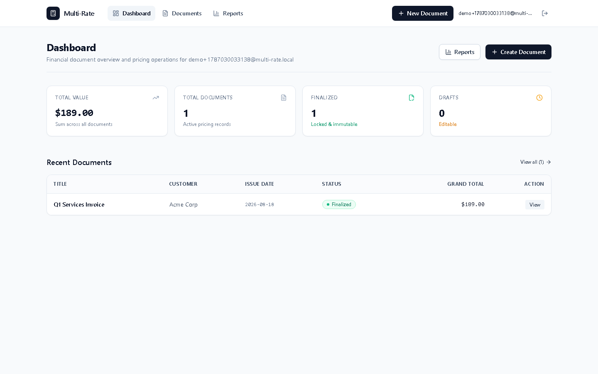

</div>

> [!NOTE]
> Every screenshot in this README (§19) is a real capture — signed up, created, and finalized a live document against a running instance of this exact codebase, not a mockup. Every diagram is a real [Mermaid](https://mermaid.js.org/) rendering of the actual request/data flow in the codebase. No logo asset exists in this repository yet, so there's no wordmark above.

---

## Table of Contents

1. [Why this exists](#1-why-this-exists)
2. [Features](#2-features)
3. [Demo & live links](#3-demo--live-links)
4. [Architecture overview](#4-architecture-overview)
5. [Folder structure](#5-folder-structure)
6. [Tech stack](#6-tech-stack)
7. [Core workflow](#7-core-workflow)
8. [The calculation engine](#8-the-calculation-engine)
9. [Database](#9-database)
10. [API documentation](#10-api-documentation)
11. [Frontend](#11-frontend)
12. [Backend](#12-backend)
13. [Testing](#13-testing)
14. [Security](#14-security)
15. [Performance & indexing](#15-performance--indexing)
16. [Deployment](#16-deployment)
17. [Development](#17-development)
18. [Environment variables](#18-environment-variables)
19. [Screenshots](#19-screenshots)
20. [Future roadmap](#20-future-roadmap)
21. [Engineering decisions](#21-engineering-decisions)
22. [Lessons learned](#22-lessons-learned)
23. [Contributing](#23-contributing)
24. [License](#24-license)
25. [Acknowledgements](#25-acknowledgements)

---

## 1. Why this exists

Line-item pricing — quotes, invoices, purchase orders — looks trivial until you actually build it. Three problems keep showing up in real systems:

- **Floating-point arithmetic lies.** `0.1 + 0.2 !== 0.3` in every language with IEEE‑754 floats. A pricing engine that stores `unitPrice: 19.99` as a JS `number` and multiplies it by quantity will eventually produce an invoice where the printed line items don't sum to the printed total — a bug that looks cosmetic until an auditor finds it.
- **"Editable forever" isn't how money works.** Once a quote is sent to a customer or an invoice is issued, it has to stop changing — including by the person who created it. Most CRUD apps don't model that: a `PUT` just overwrites the row, silently rewriting financial history.
- **Rounding rules are a business decision, not an implementation detail.** Whether a 10% discount on $99.99 rounds to $10.00 or $9.999 (and what happens when the client sends the tax and the server disagrees) determines whether the printed subtotal actually reconciles with the printed total. That has to be decided once, centrally, and enforced everywhere — not re-implemented per screen.

**Multi-Rate** solves this by pushing every money value through a single pure function, `calculateLineItem`, that works exclusively in **integer cents** and **integer basis points**, and by making the server — never the client — the sole authority on totals and on whether a document can still be edited. See [§8](#8-the-calculation-engine) and [§21](#21-engineering-decisions) for the mechanics and the reasoning.

---

## 2. Features

### Calculation engine (`packages/shared`)
- **Deterministic integer-cents math** — `parseMoney`, `parsePercentage`, `calculateLineItem`, `calculateDocumentTotals`, `formatMoney`. Zero framework or database dependency, so the exact same code computes the live preview in the browser and the authoritative total on the server. *Why it matters:* eliminates an entire class of "frontend and backend disagree on the total" bugs by construction.
- **Half-up rounding at the line boundary**, document totals are a straight sum of already-rounded lines (never re-rounded). *Why it matters:* matches how humans read printed invoices — the line items visibly add up to the grand total.
- **BigInt-backed decimal parsing** with `Number.isSafeInteger` assertions on every arithmetic step. *Why it matters:* large invoices (500 lines × $1M unit price) fail loudly with a typed `CalculationError` instead of silently overflowing.

### Backend (`apps/api`)
- **Fastify 5 layered architecture** — Routes → Middleware → Services → Repositories → MongoDB, with repository interfaces (`contracts.ts`) injected into `buildApp()`, so the whole HTTP surface can run against an in-memory repository in tests. *Why it matters:* the test suite exercises real route/service/validation logic without a database in the loop, and still exercises real MongoDB separately (see [§13](#13-testing)).
- **Argon2id password hashing** and **HMAC-SHA-256 hashed session tokens** (raw tokens are never persisted). *Why it matters:* a database read leak can't be turned into working session tokens or plaintext passwords.
- **Atomic, filter-based state transitions** — every mutating MongoDB query filters on `{ _id, ownerId, status: 'draft' }` in one operation, so finalization races resolve deterministically instead of via read-then-write. *Why it matters:* two concurrent `PUT` and `finalize` requests against the same document can't both "win."
- **Uniform error envelope** — every error, from Zod validation to unexpected exceptions, resolves to `{ error: { code, message, details } }` with the correct HTTP status. *Why it matters:* the frontend has exactly one error-shape to handle.

### Frontend (`apps/web`)
- **Next.js 15 App Router** SPA-style dashboard with a typed `ApiClient` that centralizes bearer-token auth, JSON parsing, and error normalization.
- **Live client-side calculation preview** — the line-items editor imports the *same* `calculateLineItem`/`calculateDocumentTotals` functions the API uses, so totals update per keystroke before the request is even sent. The server remains authoritative on write; this is UX only.
- **Explicit async states** (`LoadingState`, `ErrorState`, `EmptyState`) and confirmation modals (`role="dialog"`, `aria-modal`) for destructive/irreversible actions (delete, finalize).

### Developer experience & infrastructure
- **npm workspaces monorepo** with a `predev` hook that builds `@multi-rate/shared` before anything else starts, so both apps always consume compiled, versioned domain logic instead of duplicating it.
- **Single `npm test` / `npm run typecheck` / `npm run lint` / `npm run build`** fan out across all three workspaces from the repo root.
- **Multi-stage Alpine Docker images** for both apps (`Dockerfile.api`, `Dockerfile.web`), a `docker-compose.prod.yml` for local production-parity orchestration (API + Web + MongoDB), and `apprunner.yaml` for AWS App Runner deployment.
- **GitHub Actions CI** (`.github/workflows/ci.yml`) — format check → lint → typecheck → test → build, on every push/PR to `main`/`master`.

---

## 3. Demo & live links

> [!IMPORTANT]
> No production URL is committed anywhere in this repository (no `vercel.json`, no recorded App Runner service URL, no `NEXT_PUBLIC_API_URL` pointing at a live host). Treat the section below as **what you'd fill in after deploying**, not as an existing deployment.

| Target | Status |
| --- | --- |
| Frontend (Next.js) | *Not deployed — see [§16 Deployment](#16-deployment) for the supported paths (Docker Compose / your own Vercel or Amplify project).* |
| API (Fastify) | *Not deployed — `apprunner.yaml` is ready to deploy to AWS App Runner once a MongoDB URI and `SESSION_SECRET` secret are provisioned.* |
| Health check | `GET /health` and `GET /api/health` — implemented, see [§10](#10-api-documentation). |

---

## 4. Architecture overview

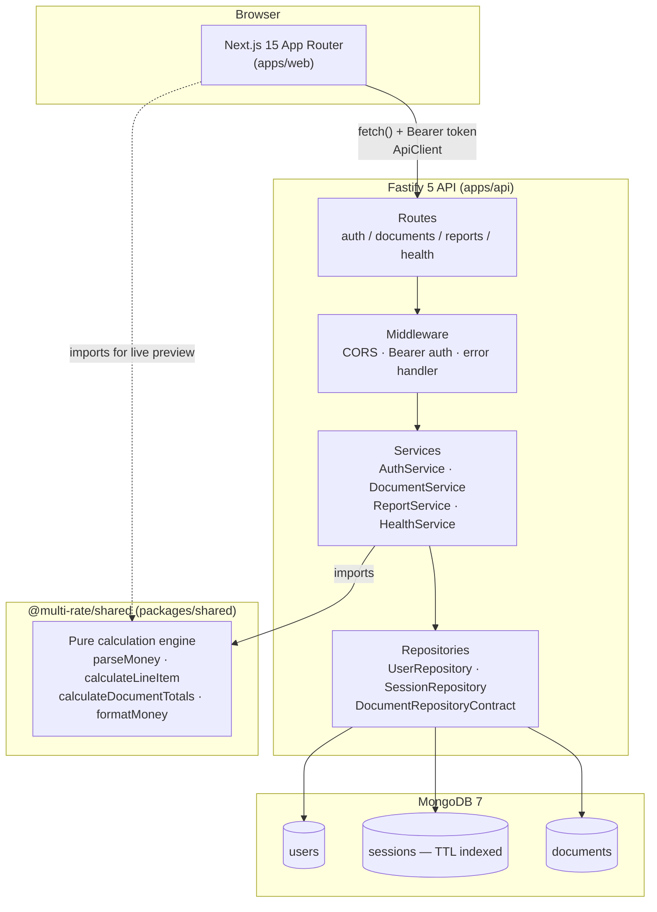

- **Frontend tier** (`apps/web`) never talks to MongoDB directly — every mutation goes through the typed `ApiClient` over HTTPS/JSON, with the calculation preview being the one deliberate exception where shared logic runs client-side purely for UX.
- **API tier** (`apps/api`) is strictly layered: routes never touch MongoDB, services never see `FastifyRequest`, and repositories are the only code aware of the MongoDB driver. This is enforced structurally — `buildApp(config, repositories)` takes the repositories as a constructor argument, so tests substitute an in-memory implementation of the exact same `Repositories` interface (`apps/api/src/repositories/contracts.ts`).
- **Shared tier** (`packages/shared`) has zero dependency on Fastify, Next.js, or MongoDB. It is built once (`npm --workspace @multi-rate/shared run build`) and consumed by both apps as a regular workspace package (`file:../../packages/shared`).
- **Data tier** is a single MongoDB database with three collections, each with purpose-built compound/TTL indexes (see [§9](#9-database)).

### Request lifecycle

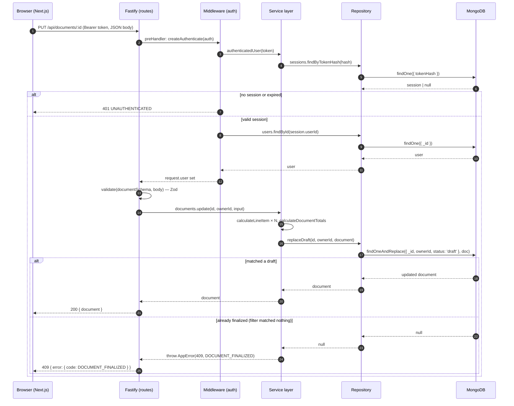

### Document lifecycle (finalization immutability)

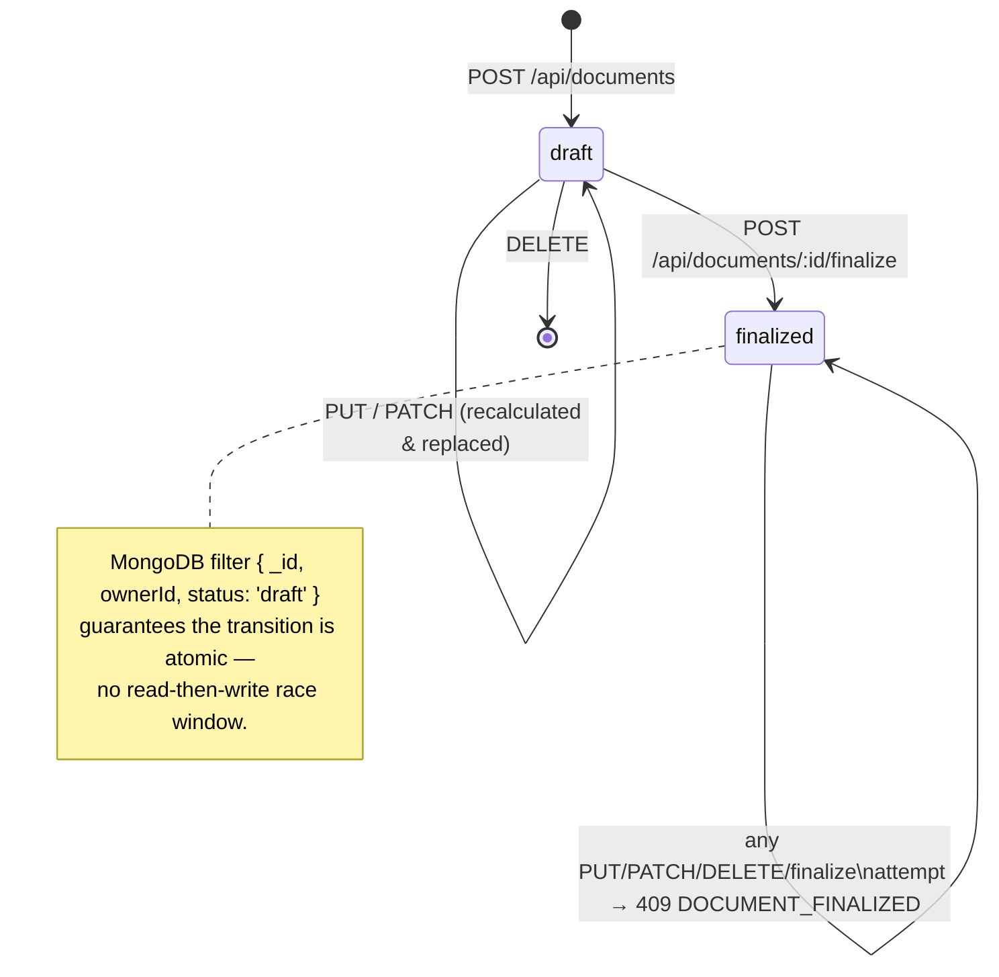

---

## 5. Folder structure

```text
.
├── apps/
│   ├── api/                          # Fastify REST API
│   │   ├── src/
│   │   │   ├── app.ts                # buildApp(): wires CORS, error handler, route registration
│   │   │   ├── server.ts             # entrypoint: connects Mongo, ensures indexes, starts listening
│   │   │   ├── config/env.ts         # Zod-validated environment schema (fails fast on boot)
│   │   │   ├── database/mongo.ts     # MongoDatabase: connection lifecycle
│   │   │   ├── domain/               # DocumentRecord, UserRecord, SessionRecord types
│   │   │   ├── errors/app-error.ts   # AppError: typed (statusCode, code, message, details)
│   │   │   ├── handlers/             # health-handler.ts
│   │   │   ├── middleware/           # authentication.ts (Bearer→user), error-handler.ts
│   │   │   ├── repositories/         # contracts.ts (interfaces) + Mongo implementations
│   │   │   ├── routes/               # auth / document / report / health route registration
│   │   │   ├── services/             # AuthService, DocumentService, ReportService, HealthService
│   │   │   └── validation/           # Zod schemas + validate() helper
│   │   └── test/                     # Vitest: auth+document lifecycle, real-Mongo repos, health
│   │
│   └── web/                          # Next.js 15 App Router frontend
│       ├── app/                      # login, signup, dashboard, documents/*, reports (route segments)
│       ├── components/
│       │   ├── documents/line-items-editor.tsx   # live-calculating line item table
│       │   ├── layout/                            # AppShell, Header
│       │   └── ui/                                # StatusBadge, ConfirmModal, LoadingState/ErrorState/EmptyState
│       └── lib/
│           ├── api-client.ts         # typed ApiClient (auth, documents, reports)
│           ├── auth-context.tsx      # React context wrapping ApiClient session state
│           └── env.ts                # NEXT_PUBLIC_API_URL resolution
│
├── packages/
│   └── shared/                       # @multi-rate/shared — pure domain calculation engine
│       ├── src/calculation.ts        # parseMoney, calculateLineItem, calculateDocumentTotals, formatMoney
│       ├── src/index.ts              # public exports + shared API/domain types
│       └── test/calculation.test.ts  # 29 test cases incl. an 18-case adversarial matrix
│
├── docs/
│   └── architecture.md               # engineering-facing system reference (this README's source of truth)
│
├── .github/workflows/ci.yml          # lint → typecheck → test → build, on every push/PR
├── Dockerfile.api / Dockerfile.web    # multi-stage Alpine production images
├── docker-compose.prod.yml           # local production-parity stack (API + Web + MongoDB 7)
├── apprunner.yaml                    # AWS App Runner deployment definition (API only)
├── .env.example                      # documents every environment variable across both apps
└── package.json                      # npm workspaces root: dev/build/test/lint fan-out scripts
```

---

## 6. Tech stack

| Layer | Technology | Notes |
| --- | --- | --- |
| Language | TypeScript 5.7 | Strict mode across all three workspaces |
| Backend framework | Fastify 5 | `@fastify/cors`, custom error handler, `bodyLimit: 1_048_576` |
| Frontend framework | Next.js 15 (App Router) | React 19, client components (`'use client'`) throughout |
| Database | MongoDB 7 | Official `mongodb` driver 6.x, no ORM |
| Validation | Zod 3 | Request bodies/params/queries; also validates environment variables at boot |
| Password hashing | Argon2id (`argon2` 0.45) | Native module — Docker builder installs `python3 make g++` to compile it |
| Session tokens | Node `crypto` | 256-bit `randomBytes`, `createHash('sha256')` for storage-side hashing |
| Domain/calculation | Hand-written pure TypeScript (`packages/shared`) | No decimal/money library dependency — BigInt-backed parsing |
| Styling | Tailwind CSS 3.4 | Utility-first, no component library |
| Icons | `lucide-react` | |
| Testing | Vitest 2, `mongodb-memory-server`, Fastify `inject` | Real in-memory MongoDB for repository tests |
| CI/CD | GitHub Actions | `.github/workflows/ci.yml` |
| Containers | Docker (`node:22-alpine`, multi-stage) | Non-root `USER node` runtime stage |
| Deployment target | AWS App Runner (`apprunner.yaml`) | API only; frontend has no committed deployment config |
| Monorepo tooling | npm workspaces, `concurrently` | No Turborepo/Nx — deliberately simple for a 3-package repo |

---

## 7. Core workflow

The canonical write path — creating or editing a pricing document — looks like this end to end:

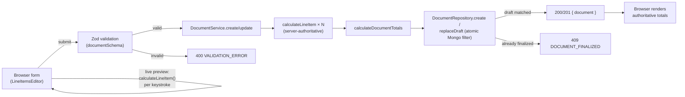

There is no queue, no background worker, and no streaming response anywhere in this codebase — every request is a single synchronous request/response cycle against Fastify, which is appropriate at the scale a per-request MongoDB `findOneAndReplace` comfortably serves. (A queue-based ingestion path would only make sense for bulk import, which is not implemented — see [§20](#20-future-roadmap).)

---

## 8. The calculation engine

The entire financial correctness guarantee of this system rests on `packages/shared/src/calculation.ts`. It is deliberately the *only* place money math happens.

### Representation

| Concept | Representation | Example |
| --- | --- | --- |
| Money | Integer cents | `$100.50` → `10050` |
| Percentage | Integer basis points (`10,000` = 100%) | `8.25%` → `825` |
| Input format | Decimal string, ≤ 2 fractional digits | `"19.99"` (validated by regex `^\d+(?:\.\d{1,2})?$`) |

`parseDecimal` converts the string to `BigInt`, multiplies by 100, and only converts back to `Number` after confirming the result is `<= Number.MAX_SAFE_INTEGER` — so a $10,000,000,000.00 unit price fails with `INVALID_MONEY` instead of silently losing precision.

### Rounding policy

1. `subtotalCents = quantity × unitPriceCents`
2. Discount:
   - `fixed`: validated `<= subtotalCents`, or throws `FIXED_DISCOUNT_EXCEEDS_SUBTOTAL`
   - `percentage`: `floor((subtotalCents × rateBasisPoints + 5000) / 10000)` — half-up rounding
   - passing **both** `fixed` and `percentage` throws `CONFLICTING_DISCOUNTS`
3. `discountedAmountCents = subtotalCents − discount.amountCents`
4. `taxCents = floor((discountedAmountCents × taxRateBasisPoints + 5000) / 10000)` — half-up, applied to the *discounted* amount
5. `totalCents = discountedAmountCents + taxCents`
6. Document totals are the **sum of already-rounded line values** — never re-rounded — so printed line items always reconcile with the printed grand total.

<details>
<summary><strong>Worked example</strong> (verified by <code>packages/shared/test/calculation.test.ts</code>)</summary>

| Line | Qty × Unit | Discount | Tax | Line Total |
| --- | --- | --- | --- | --- |
| Widget A | 2 × $100.00 = $200.00 | 10% → −$20.00 | 5% of $180.00 = $9.00 | **$189.00** |
| Widget B | 1 × $50.00 = $50.00 | none | 5% of $50.00 = $2.50 | **$52.50** |
| Service Fee | 1 × $200.00 = $200.00 | $20.00 fixed | 0% | **$180.00** |
| **Document totals** | Subtotal **$450.00** | Discounts **$40.00** | Tax **$11.50** | **Grand Total $421.50** |

</details>

### Failure modes are typed, not thrown as generic `Error`

Every rejection is a `CalculationError` with a stable `code` (`INVALID_QUANTITY`, `INVALID_MONEY`, `INVALID_PERCENTAGE`, `FIXED_DISCOUNT_EXCEEDS_SUBTOTAL`, `CONFLICTING_DISCOUNTS`, `AMOUNT_TOO_LARGE`), which `DocumentService` catches and re-throws as an `AppError(400, code, message)` — so the HTTP layer never needs to know calculation internals, only the code.

The test suite's adversarial matrix (`it.each` with 18 cases) specifically targets negative quantities, `NaN`/`Infinity`, fractional quantities, over-100% percentages, discounts exceeding the subtotal, and conflicting discount types — the inputs a hostile or buggy client is most likely to send.

> [!NOTE]
> There is no AI/LLM component anywhere in this system. Field mapping, categorization, and totals are 100% deterministic arithmetic — a deliberate choice for a financial system where "the same input always produces the same output, and that output is auditable" is a requirement, not a nice-to-have.

---

## 9. Database

MongoDB 7, no ORM — the driver is used directly, with all shape constraints enforced by Zod at the API boundary and by TypeScript domain types (`apps/api/src/domain/`) elsewhere.

### `users`

```json
{ "_id": "UUID", "email": "string (lowercase, trimmed, unique)", "passwordHash": "Argon2id hash", "createdAt": "ISODate" }
```
Index: `{ email: 1 }` unique.

### `sessions`

```json
{ "_id": "UUID", "userId": "UUID ref users._id", "tokenHash": "HMAC-SHA-256 hex", "createdAt": "ISODate", "expiresAt": "ISODate (+7d)" }
```
Indexes: `{ tokenHash: 1 }` unique · `{ expiresAt: 1 }` TTL (`expireAfterSeconds: 0`) — expired sessions are removed by MongoDB's background TTL monitor, not application code.

### `documents`

```json
{
  "_id": "UUID", "ownerId": "UUID ref users._id",
  "title": "string 1–200", "customer": "string 1–200", "issueDate": "ISODate",
  "status": "draft | finalized",
  "lineItems": [ { "description", "quantity", "unitPriceCents", "subtotalCents",
                   "discount": { "type": "none|fixed|percentage", "amountCents", "rateBasisPoints?" },
                   "discountedAmountCents", "taxRateBasisPoints", "taxCents", "totalCents" } ],
  "totals": { "subtotalCents", "totalDiscountCents", "totalTaxCents", "grandTotalCents" },
  "createdAt", "updatedAt", "finalizedAt?"
}
```
Indexes: `{ ownerId: 1, issueDate: -1 }` (reporting + chronological listing) · `{ ownerId: 1, status: 1, updatedAt: -1 }` (draft/finalized listing).

### Repository pattern & idempotency-through-atomicity

`apps/api/src/repositories/contracts.ts` defines `UserRepository`, `SessionRepository`, and `DocumentRepositoryContract` as plain TypeScript interfaces. Production code (`server.ts`) wires the real MongoDB implementations; the test suite (`apps/api/test/auth-documents.test.ts`) implements the same interfaces in-memory (`MemoryRepositories`) so route/service/validation logic can be tested with Fastify's `inject()` and zero network I/O.

There is no explicit multi-document transaction anywhere — it isn't needed, because every state-changing write is a **single atomic MongoDB operation whose filter encodes the precondition**:

```js
// finalizeDraft — only succeeds if the document is still a draft owned by this user
collection.findOneAndUpdate(
  { _id: id, ownerId, status: 'draft' },
  { $set: { status: 'finalized', finalizedAt, updatedAt: finalizedAt } },
  { returnDocument: 'after' },
);
```
If the filter matches nothing (already finalized, or not owned by this user), the driver returns `null`, and the service layer turns that into `409 DOCUMENT_FINALIZED`. This is what makes finalization race-free without a transaction: MongoDB guarantees single-document operations are atomic.

---

## 10. API documentation

All endpoints accept/return `application/json`. All non-2xx responses use the envelope:

```json
{ "error": { "code": "DOCUMENT_FINALIZED", "message": "Finalized documents cannot be changed.", "details": {} } }
```

### Authentication

| Method | Path | Auth | Description |
| --- | --- | --- | --- |
| `POST` | `/api/auth/signup` | — | `{ email, password }` (password ≥ 8 chars) → `{ user, token }`, `201`. `409 EMAIL_IN_USE` on duplicate. |
| `POST` | `/api/auth/login` | — | `{ email, password }` → `{ user, token }`, `200`. `401 INVALID_CREDENTIALS` on mismatch. |
| `POST` | `/api/auth/logout` | Bearer | Deletes the session record. `204 No Content`. |
| `GET` | `/api/auth/me` | Bearer | Returns `{ user }` for the authenticated session. |

<details>
<summary>Example: signup</summary>

```http
POST /api/auth/signup HTTP/1.1
Content-Type: application/json

{ "email": "ops@acme.com", "password": "correct horse battery staple" }
```

```json
201 Created
{ "user": { "id": "…", "email": "ops@acme.com", "createdAt": "2026-01-01T00:00:00.000Z" }, "token": "…base64url…" }
```
</details>

### Documents

| Method | Path | Auth | Description |
| --- | --- | --- | --- |
| `GET` | `/api/documents` | Bearer | List documents owned by the authenticated user, sorted by `updatedAt` descending. |
| `POST` | `/api/documents` | Bearer | Create a draft. Body validated against `documentSchema`. `201 { document }`. |
| `GET` | `/api/documents/:id` | Bearer | `200 { document }` or `404 DOCUMENT_NOT_FOUND` (including if owned by another user). |
| `PUT` | `/api/documents/:id` | Bearer | Full replace of a draft. `409 DOCUMENT_FINALIZED` if not a draft. |
| `PATCH` | `/api/documents/:id` | Bearer | Same handler and same body schema as `PUT` in this implementation. |
| `DELETE` | `/api/documents/:id` | Bearer | `204` on success. `409 DOCUMENT_FINALIZED` if not a draft. |
| `POST` | `/api/documents/:id/finalize` | Bearer | Locks the document permanently. `409 DOCUMENT_FINALIZED` if already finalized. |

<details>
<summary>Example: create → finalize → mutate (rejected)</summary>

```http
POST /api/documents
Authorization: Bearer <token>

{
  "title": "Q1 Services Invoice", "customer": "Acme Corp", "issueDate": "2026-01-15",
  "lineItems": [
    { "description": "Widget A", "quantity": 2, "unitPrice": "100.00",
      "discount": { "percentage": "10" }, "taxRate": "5" }
  ]
}
```
```json
201 Created
{ "document": { "_id": "…", "status": "draft", "totals": { "grandTotalCents": 18900, "...": "..." }, "...": "..." } }
```
```http
POST /api/documents/{id}/finalize
Authorization: Bearer <token>
```
```json
200 OK
{ "document": { "status": "finalized", "finalizedAt": "2026-01-15T12:00:00.000Z", "...": "..." } }
```
```http
DELETE /api/documents/{id}
Authorization: Bearer <token>
```
```json
409 Conflict
{ "error": { "code": "DOCUMENT_FINALIZED", "message": "Finalized documents cannot be deleted." } }
```
</details>

### Reporting

| Method | Path | Auth | Description |
| --- | --- | --- | --- |
| `GET` | `/api/reports/summary?startDate=YYYY-MM-DD&endDate=YYYY-MM-DD` | Bearer | Aggregated `documentCount` and `totals` for the authenticated user's documents in `[startDate, endDate]` UTC, inclusive. |

### Health

| Method | Path | Auth | Description |
| --- | --- | --- | --- |
| `GET` | `/health` (also mounted at `/api/health`) | — | `{ status: 'ok', uptimeSeconds, timestamp, database: 'connected' \| 'disconnected' }` — live MongoDB ping status. |

### Error codes

| HTTP | Codes | Meaning |
| --- | --- | --- |
| `400` | `VALIDATION_ERROR`, `INVALID_QUANTITY`, `INVALID_MONEY`, `INVALID_PERCENTAGE`, `CONFLICTING_DISCOUNTS`, `FIXED_DISCOUNT_EXCEEDS_SUBTOTAL`, `AMOUNT_TOO_LARGE` | Malformed request or invalid financial input |
| `401` | `UNAUTHENTICATED`, `INVALID_CREDENTIALS` | Missing/expired/invalid token, or bad login |
| `404` | `DOCUMENT_NOT_FOUND` | Non-existent or not-owned-by-caller (enumeration prevention, see [§14](#14-security)) |
| `409` | `EMAIL_IN_USE`, `DOCUMENT_FINALIZED` | Duplicate signup, or mutation attempted on a finalized document |
| `500` | `INTERNAL_ERROR` | Unhandled exception; message is sanitized, stack trace is server-logged only |

---

## 11. Frontend

- **Upload/create flow** — there is no CSV or file upload in this system. Document creation is a form (`/documents/new`) driven by `LineItemsEditor`, which computes a **live preview** of every line and the grand total on every keystroke using the exact same `calculateLineItem`/`calculateDocumentTotals` functions the server uses — so what the user sees before submitting matches what the server will compute after.
- **Results view** (`/documents/[id]`) renders the server-authoritative document: itemized breakdown table, financial summary panel, a `window.print()`-based print action, and status-gated actions (`Edit` / `Delete` / `Finalize` only shown for drafts; a "Locked & Immutable" badge for finalized documents).
- **Reports view** (`/reports`) — date-range picker with quick presets (This Month / Last 30 Days / YTD) driving `GET /api/reports/summary`.
- **Async states** — every data-fetching page distinguishes loading (`role="status"`), error (`role="alert"`, with retry), and empty states as separate, reusable components rather than inline conditionals.
- **Confirmation modals** for irreversible actions (delete, finalize) use `role="dialog"` / `aria-modal="true"`.
- **Responsive layout** — Tailwind responsive utilities (`sm:`/`md:`/`lg:` breakpoints) throughout; tables scroll horizontally on narrow viewports (`overflow-x-auto`).

> [!NOTE]
> **Not implemented:** dark mode (Tailwind config has no `darkMode` strategy or `dark:` variants anywhere in the codebase), animation beyond a couple of `animate-spin`/`animate-in` utility classes, and list virtualization (document lists are rendered in full — appropriate at the scale a single-tenant dashboard serves today, but see [§20](#20-future-roadmap) for what changes at larger scale).

---

## 12. Backend

- **Controllers/Routes** (`src/routes/*.ts`) — thin Fastify route registration functions. They call `validate(schema, input)` and delegate immediately to a service; no business logic lives here.
- **Services** (`src/services/*.ts`) — `AuthService`, `DocumentService`, `ReportService`, `HealthService`. This is where calculation, ownership checks, and lifecycle rules (`assertDraft`) live.
- **Repositories** (`src/repositories/*.ts`) — the only layer that imports the `mongodb` package. Interfaces live in `contracts.ts`; `DocumentRepository`, `MongoUserRepository`, `MongoSessionRepository` are the production implementations.
- **Dependency injection** — `buildApp(config, repositories?, pingDb?)` accepts repositories as a parameter rather than importing MongoDB implementations directly, which is what lets the test suite substitute in-memory repositories without any mocking framework.
- **Logging** — Fastify's built-in Pino logger (`config.LOG_LEVEL`); unexpected exceptions are logged server-side (`request.log.error(error)`) before returning the sanitized `500` response.
- **Error handling** — a single `registerErrorHandler` distinguishes `AppError` (explicit, typed), `ZodError` (validation), Fastify client errors (malformed JSON, oversized body), and unhandled exceptions, mapping each to the correct status and envelope.

---

## 13. Testing

```sh
npm test                              # all three workspaces
npm --workspace @multi-rate/shared test   # calculation engine only
npm --workspace @multi-rate/api test      # API integration tests
```

| Suite | File | What it verifies |
| --- | --- | --- |
| Calculation engine | [`packages/shared/test/calculation.test.ts`](packages/shared/test/calculation.test.ts) | 29 cases: fractional/negative quantities, discount edge cases (100% discount, fixed exceeding subtotal), half-up rounding boundaries, floating-point-drift proofs, and an 18-case `it.each` adversarial matrix targeting `NaN`/`Infinity`/conflicting-discount inputs. |
| API & lifecycle | [`apps/api/test/auth-documents.test.ts`](apps/api/test/auth-documents.test.ts) | 17 cases via Fastify `inject()` against an in-memory `MemoryRepositories`: signup/login/logout, cross-user isolation (User A cannot read/mutate User B's documents — asserts `404`, not `403`), finalized-document immutability across every mutating verb, malformed JSON, and date-range query boundaries. |
| Real MongoDB integration | [`apps/api/test/mongodb-repositories.test.ts`](apps/api/test/mongodb-repositories.test.ts) | End-to-end lifecycle against a real `mongodb-memory-server` instance — index creation, TTL session cleanup, and the aggregation pipeline used by `/api/reports/summary`. |
| Health | `apps/api/test/health.test.ts` | Health endpoint shape and DB-ping status reporting. |

Across the three workspaces this totals **48 `it()`/`it.each`-generated test cases**. CI (`.github/workflows/ci.yml`) runs `format:check → lint → typecheck → test → build` on every push and pull request to `main`/`master` — a red run blocks merge in spirit (branch protection is not configured in this repo, only the workflow itself).

> [!NOTE]
> There is no frontend test suite beyond `vitest run --passWithNoTests` in `apps/web/package.json` — i.e. the `test` script exists and passes trivially, but no `apps/web/**/*.test.ts(x)` files currently exist. This is an honest gap, not a hidden one — see [§20](#20-future-roadmap).

---

## 14. Security

| Control | Implementation | Status |
| --- | --- | --- |
| Password hashing | Argon2id (`argon2` native module), constant-time verify | ✅ Implemented |
| Session tokens | 256-bit random, HMAC-SHA-256 hashed at rest, never stored raw | ✅ Implemented |
| Session expiry | 7-day TTL, enforced both by app logic and MongoDB's TTL index | ✅ Implemented |
| Resource enumeration prevention | Unowned documents return `404`, never `403` | ✅ Implemented |
| CORS | Explicit origin allowlist via `WEB_ORIGIN` (comma-separated); no-Origin requests (curl, server-to-server) allowed through | ✅ Implemented |
| Request body limit | Fastify `bodyLimit: 1_048_576` (1 MB) | ✅ Implemented |
| Line-item cap | Max 500 line items per document (Zod `.max(500)`) | ✅ Implemented |
| Error sanitization | Unhandled exceptions return a generic `INTERNAL_ERROR` message; stack traces are server-log-only | ✅ Implemented |
| Environment validation | `loadConfig()` throws at boot on an invalid/missing environment (Zod schema) — fails fast instead of running misconfigured | ✅ Implemented |
| Rate limiting / brute-force protection | — | ❌ **Not implemented.** `/api/auth/login` and `/api/auth/signup` have no throttle. `@fastify/rate-limit` is not a dependency. |
| Security headers (Helmet-equivalent) | — | ❌ **Not implemented.** `@fastify/helmet` is not a dependency. |
| CSRF protection | — | Not applicable to the current design (bearer-token auth, no cookies), but worth stating explicitly rather than leaving implicit. |
| Prompt/CSV injection | — | Not applicable — there is no LLM and no CSV ingestion in this system. |

---

## 15. Performance & indexing

- **`{ ownerId: 1, issueDate: -1 }`** — serves both the reporting aggregation's `$match` stage and chronologically sorted document queries without a collection scan.
- **`{ ownerId: 1, status: 1, updatedAt: -1 }`** — serves the default document list view (most-recently-updated first) and future draft/finalized filtering.
- **`{ tokenHash: 1 }`** unique — every authenticated request does exactly one indexed point lookup to resolve a session.
- **Server-side aggregation** — `GET /api/reports/summary` computes sums inside MongoDB (`$match` + `$group`) and returns one aggregate document, instead of pulling every matching document into Node.js memory to sum client-side.
- **Integer arithmetic throughout** — beyond correctness, integer math is cheaper than decimal-library arithmetic (no `BigDecimal`-equivalent allocation per operation); `BigInt` is used only transiently during string parsing, not for the hot calculation path.
- **No caching layer** (Redis, in-memory LRU, HTTP caching headers) is present anywhere in the codebase — every request round-trips to MongoDB. This is a deliberate non-feature at current scale, not an oversight; see [§20](#20-future-roadmap) for what would trigger adding one.

---

## 16. Deployment

### Local — Docker Compose (production-parity)

```sh
docker compose -f docker-compose.prod.yml up --build -d
```

Brings up `mongodb:7.0` (with a healthcheck gating API startup), the API container (`Dockerfile.api`, port `4000`), and the Web container (`Dockerfile.web`, port `3000`, built with `NEXT_PUBLIC_API_URL` baked in at build time as a Next.js public env var).

### AWS App Runner (API)

`apprunner.yaml` defines the build (`npm ci` → build `shared` → build `api`) and run command (`node apps/api/dist/server.js`) with the port bound to App Runner's `PORT` env var. To deploy:

1. Provision MongoDB (Atlas cluster or DocumentDB).
2. Store `MONGODB_URI` and `SESSION_SECRET` in AWS Secrets Manager.
3. Point App Runner at this repo/branch — it will pick up `apprunner.yaml` automatically.
4. Set `WEB_ORIGIN` to your deployed frontend's origin.

### Frontend hosting

No frontend deployment configuration (`vercel.json`, Amplify config, etc.) is committed in this repository. `Dockerfile.web` is host-agnostic — it produces a standard `node ... run start` Next.js container that can run on AWS ECS/Amplify, Vercel, or any container platform, with `NEXT_PUBLIC_API_URL` supplied as a build arg pointing at the deployed API.

### Production checklist

- [ ] `SESSION_SECRET` is a unique, random, ≥32-character value per environment (not the example value)
- [ ] `WEB_ORIGIN` lists only real, trusted frontend origins (no wildcard in production)
- [ ] `MONGODB_URI` uses TLS and least-privilege credentials
- [ ] `LOG_LEVEL=info` or stricter (avoid `debug`/`trace` in production)
- [ ] A reverse proxy or CDN terminates TLS in front of the API if App Runner's managed TLS isn't sufficient for your compliance posture
- [ ] Rate limiting is added before exposing `/api/auth/*` publicly at scale (see [§14](#14-security))

---

## 17. Development

### Prerequisites

- Node.js ≥ 22, npm ≥ 10 (enforced by `package.json` `engines`)
- A MongoDB instance (local `mongod`, Docker, or MongoDB Atlas)

### Setup

```sh
git clone <repo-url> && cd multi-calci
npm install

cp .env.example apps/api/.env        # set MONGODB_URI and a real SESSION_SECRET
cp apps/web/.env.example apps/web/.env.local

npm run dev                          # runs shared build, then web (:3000) + api (:4000) concurrently
```

### Common scripts (root `package.json`)

| Script | Effect |
| --- | --- |
| `npm run dev` | Builds `@multi-rate/shared`, then runs `web` + `api` dev servers concurrently |
| `npm test` | Runs Vitest across `shared` → `api` → `web`, sequentially |
| `npm run typecheck` | Builds `shared` (for its `.d.ts` output), then typechecks all three workspaces |
| `npm run lint` | `eslint . --max-warnings=0` |
| `npm run format` / `format:check` | Prettier write / check across the repo |
| `npm run build` | Production build of `shared` → `api` → `web`, in that order (dependency order matters) |

---

## 18. Environment variables

| Variable | Scope | Required | Description | Default / Example |
| --- | --- | --- | --- | --- |
| `NODE_ENV` | API | No | `development` \| `test` \| `production` | `development` |
| `PORT` | API | No | HTTP port | `4000` |
| `MONGODB_URI` | API | **Yes** | MongoDB connection string | `mongodb://localhost:27017` |
| `MONGODB_DATABASE` | API | No | Database name | `multi_rate_pricing` |
| `WEB_ORIGIN` | API | No | Comma-separated CORS allowlist | `http://localhost:3000` |
| `SESSION_SECRET` | API | **Yes** | HMAC-SHA-256 key for session token hashing — min 32 chars, boot fails otherwise | *(none — must be set)* |
| `LOG_LEVEL` | API | No | `fatal`\|`error`\|`warn`\|`info`\|`debug`\|`trace` | `info` |
| `NEXT_PUBLIC_API_URL` | Web | **Yes** | Base URL the browser fetches against | `http://localhost:4000/api` |

All validation is enforced by `apps/api/src/config/env.ts` (Zod) at process boot — a missing `SESSION_SECRET` or `MONGODB_URI` crashes the server immediately with a descriptive error, rather than surfacing as a confusing runtime failure later.

---

## 19. Screenshots

All captures below are real — taken against a live instance of this exact codebase (dev servers + an in-memory MongoDB), walking through an actual signup → create → finalize → report flow. No mockups, no fabricated data. Source files live in [`docs/screenshots/`](docs/screenshots/).

<table>
<tr>
<td width="50%">

**Sign up**
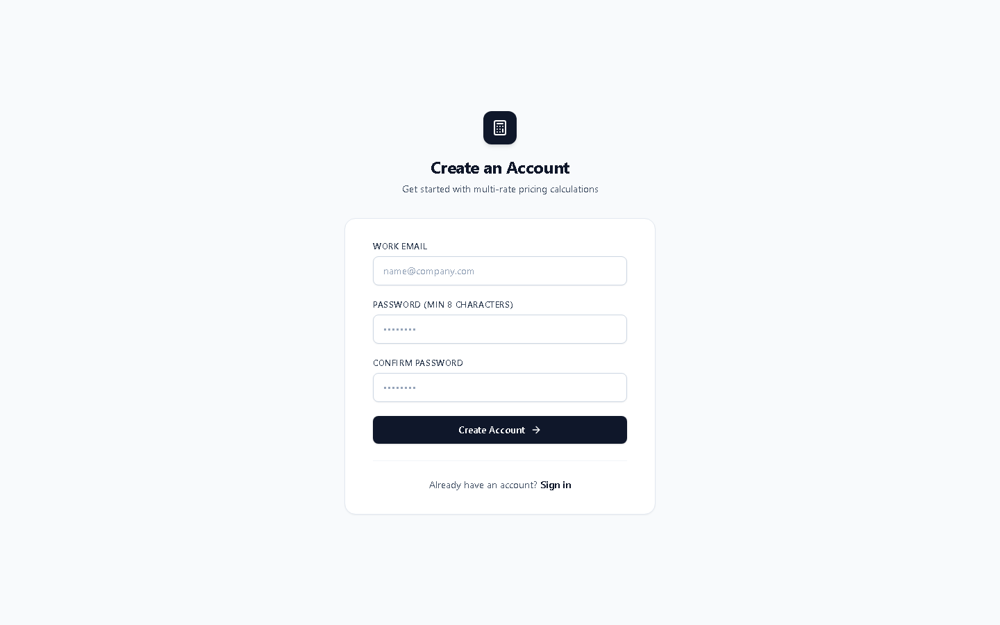

</td>
<td width="50%">

**Empty dashboard**
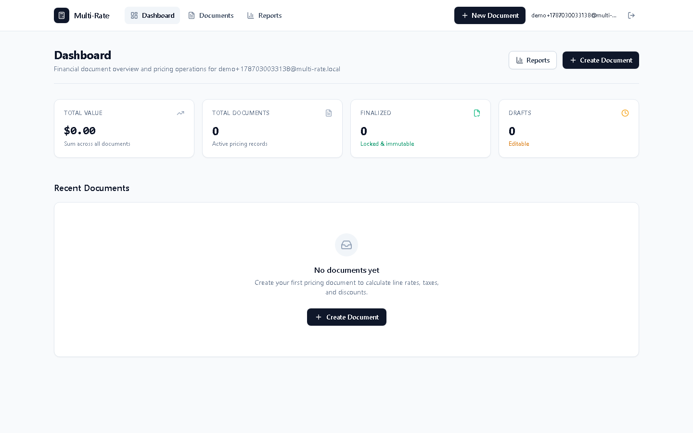

</td>
</tr>
<tr>
<td width="50%">

**Line-items editor — live calculation preview**
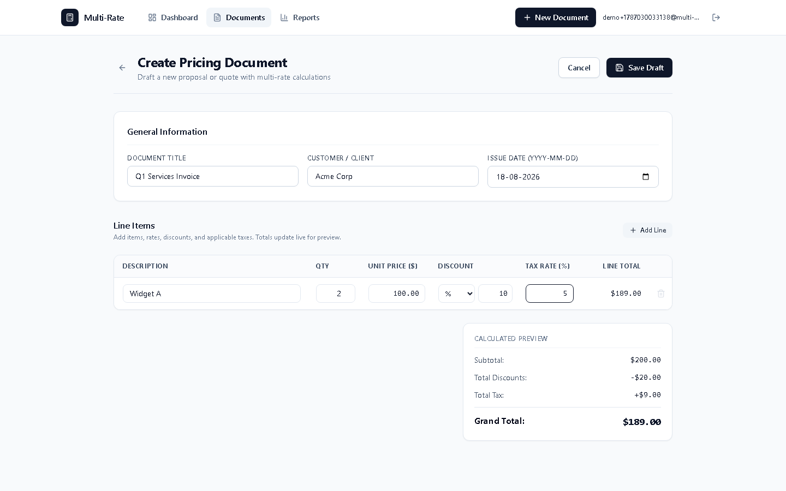

</td>
<td width="50%">

**Draft document detail**
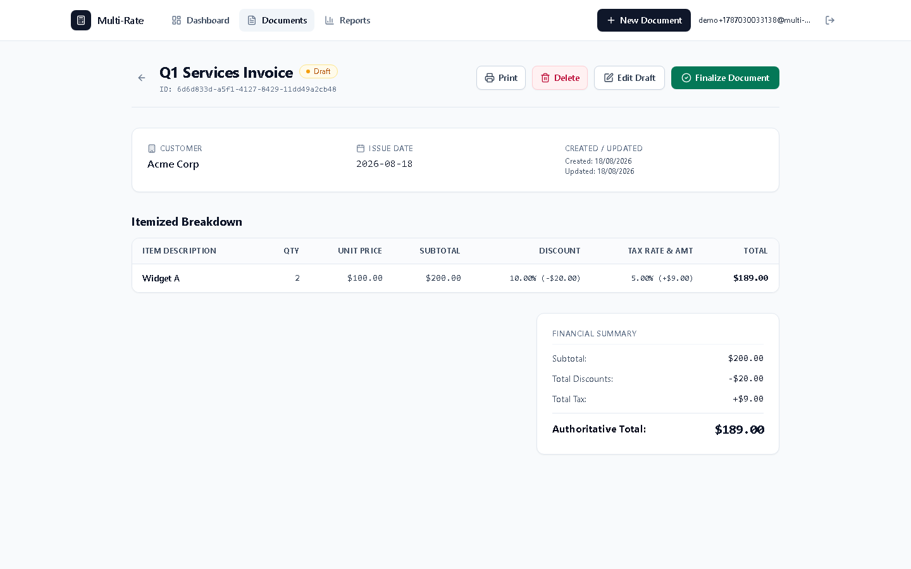

</td>
</tr>
<tr>
<td width="50%">

**Finalize confirmation**


</td>
<td width="50%">

**Finalized document — locked & immutable**
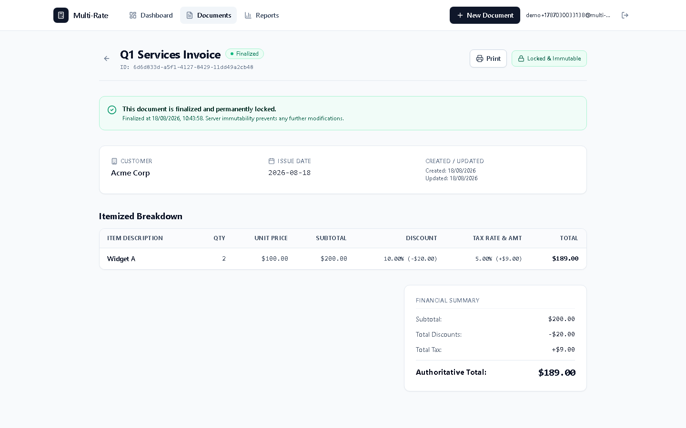

</td>
</tr>
<tr>
<td width="50%">

**Dashboard with data**


</td>
<td width="50%">

**Financial reports**
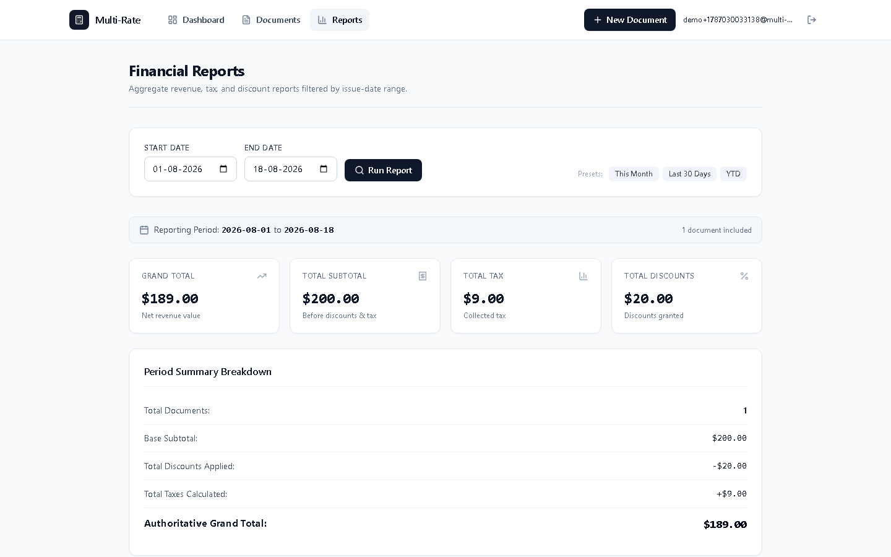

</td>
</tr>
</table>

Note the numbers reconcile end to end: a $200.00 subtotal with a 10% discount (−$20.00) and 5% tax on the discounted amount (+$9.00) produces a $189.00 grand total in the editor's live preview, the draft detail view, the finalized detail view, the dashboard, and the reports aggregate — the same authoritative total computed once by `calculateLineItem`/`calculateDocumentTotals` and never recomputed differently by any surface.

No GIF or animated walkthrough is included — only static captures.

---

## 20. Future roadmap

Grounded in gaps identified while writing this document — none of the following exist in the codebase today:

- **Rate limiting** (`@fastify/rate-limit`) on `/api/auth/login` and `/api/auth/signup` to prevent credential stuffing.
- **Audit logging / event sourcing** — an immutable log of every state transition (`created`, `updated`, `finalized`, `deleted`) with actor and timestamp, for financial/regulatory traceability.
- **Cursor-based pagination** for `GET /api/documents` — current implementation returns the full owner-scoped list, fine at hundreds of documents, not at tens of thousands.
- **Server-side PDF export** — the current "Print" action is a `window.print()` browser dialog; a Puppeteer/Chromium-based export service would produce a consistent, downloadable PDF.
- **Frontend test coverage** — `apps/web` currently has no component/integration tests (`vitest run --passWithNoTests` passes vacuously).
- **Security headers** (`@fastify/helmet`) and a documented Content-Security-Policy.
- **Multi-currency support** — the calculation engine currently assumes a single implicit currency; basis-point tax/discount math would need a currency-aware minor-unit table (not all currencies have 2 decimal places) to generalize.
- **Role-based access control** — today, ownership is binary (you own a document or you don't); there's no concept of a shared workspace, team, or approver role.

---

## 21. Engineering decisions

| Decision | Alternative considered | Why this repo chose what it chose |
| --- | --- | --- |
| **Bearer session tokens, hashed server-side** | Stateless JWTs | JWTs can't be revoked without a blocklist. A hashed, TTL-indexed session record makes `POST /api/auth/logout` an actual, immediate revocation — important for a financial system where "I logged out" should mean something. |
| **Integer cents / basis points, hand-rolled** | A decimal/money library (e.g. `dinero.js`, `decimal.js`) | The domain only needs four operations (multiply, percentage-round, add, subtract) with one rounding rule. A ~200-line pure module with 29 targeted tests is easier to audit line-by-line than trusting a general-purpose decimal library's rounding semantics match the business rule exactly. |
| **404, not 403, for unowned resources** | Returning `403 Forbidden` | `403` confirms the resource *exists* and is just off-limits — letting an attacker enumerate valid document IDs by binary-searching status codes. `404` reveals nothing. |
| **Repository interfaces + constructor injection, no DI framework** | InversifyJS / tsyringe / NestJS-style decorators | Three interfaces (`UserRepository`, `SessionRepository`, `DocumentRepositoryContract`) and one factory function (`buildApp`) don't need a framework — plain TypeScript interfaces plus passing the implementation as a parameter achieves the same testability with zero extra dependency surface. |
| **Fastify over Express** | Express (the more ubiquitous choice) | Built-in JSON schema validation hooks, first-class async/await handler support, and materially better raw throughput — relevant given every request does synchronous integer math plus a MongoDB round-trip. |
| **npm workspaces, no Turborepo/Nx** | A dedicated monorepo build tool | Three packages with a linear dependency chain (`shared` → `api`/`web`) don't need a task graph orchestrator; a `predev` hook and ordered `&&` scripts in `package.json` express the same dependency with far less configuration. |
| **No transactions; atomic single-document filters instead** | MongoDB multi-document transactions for finalize/update | Every state transition in this domain touches exactly one document. Encoding the precondition (`status: 'draft'`) directly in the update filter is simpler and cheaper than opening a transaction session for an invariant a single atomic operation already guarantees. |

---

## 22. Lessons learned

- **Money bugs hide in the boundary, not the formula.** The rounding formula (`floor((x + 5000) / 10000)`) is one line; the actual engineering effort went into deciding *where* rounding happens (per line, not per document) and proving it with adversarial tests (100% discounts, discounts equal to the subtotal, tax on a zero-discounted amount) rather than just the happy path.
- **Sharing one calculation function between client and server is a testing strategy, not just a DRY exercise.** Because `LineItemsEditor` imports the exact same `calculateLineItem` the API uses, any bug the frontend preview has, the backend has too — which means the 29 shared-package tests protect both surfaces simultaneously, and a client/server total mismatch is structurally impossible rather than something QA has to catch.
- **Filter-encoded preconditions beat read-then-write for single-document invariants.** `findOneAndUpdate({ status: 'draft' }, ...)` is both the race-condition fix *and* the business-rule enforcement, in one line — no separate "check if draft" query, no transaction, no lock.
- **A repository interface is worth writing even for a single database.** This project only ever ships against MongoDB — the interfaces in `contracts.ts` weren't written for portability to another database, they were written so the test suite could substitute an in-memory implementation and exercise real route/service/validation code without paying for a MongoDB connection per test run.
- **Documenting what's *not* built is part of the deliverable.** Sections 14 and 20 of this README exist because a system that silently omits rate limiting or PDF export and never says so reads as more finished than it is — an honest gap list is more useful to the next engineer than a README that implies completeness.

---

## 23. Contributing

This is currently a single-maintainer portfolio project without a formalized external contribution process. If you'd like to contribute:

1. Fork the repository and create a feature branch.
2. Run `npm install` at the repo root (workspaces install together).
3. Match the existing layering — new backend logic belongs in a service, not a route; new money math belongs in `packages/shared`, not duplicated in `apps/api` or `apps/web`.
4. Before opening a PR, run the same checks CI runs:
   ```sh
   npm run format:check && npm run lint && npm run typecheck && npm test && npm run build
   ```
5. Add tests alongside new logic — particularly for any change to `packages/shared/src/calculation.ts`, which should include both a happy-path case and an adversarial one.
6. Open a PR describing the change and, if it affects money handling or the document lifecycle, the specific edge case it addresses.

---
## Author

**Habin Rahman**

Software Engineer focused on AI products, developer tools, and production-grade AI systems.

- GitHub: https://github.com/habinrahman
- LinkedIn: https://www.linkedin.com/in/habinrahman


---
## 24. License


No `LICENSE` file and no `license` field in any `package.json` are currently present in this repository — all packages are marked `"private": true`. Until a license is added, the code is **all rights reserved by default** (standard copyright law applies in the absence of an explicit license). If you intend this project to be open source, add a `LICENSE` file (MIT is a common, permissive default) and a corresponding `license` field to each `package.json`.

---

## 25. Acknowledgements

Built on [Fastify](https://fastify.dev/), [Next.js](https://nextjs.org/), [MongoDB](https://www.mongodb.com/), [Zod](https://zod.dev/), [Argon2](https://github.com/ranisalt/node-argon2), [Vitest](https://vitest.dev/), [Tailwind CSS](https://tailwindcss.com/), and [Lucide](https://lucide.dev/) — full dependency list in each workspace's `package.json`.
